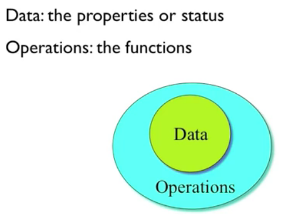

## C++笔记

#### 1 第一个c++函数

hello world1

#### 2-3 面向对象基本原理

- Objects对象 = Attributes属性  + Services服务

- `鸡蛋`模型

  

这个`鸡蛋`模型形象的告诉我们：对于一个对象而言，我们不会轻易地去触碰到他的`Data`，必须通过`Operations`来访问。

- c语言：过程性语言

  c++：面向对象`object-oriented`（自己的理解：在编程的过程中，先不去关注`data-flow`，`算法实现`，而是先去关注`things`具有哪些`属性`，哪些`操作`，把这个`things`封装在一个`object`中，最后再去调用，实现流程。）

- Objects send messages

  Object(实体，是一个对象) vs. Class(抽象，某种概念

- OOP Characteristics
  - Everything is an object
  - A program is a bunch of objects telling each other **what to do** by sending messages.(c++ 的程序在运行的时候，其实就是`一堆对象`互相发消息告诉其他的对象`去做什么`；那c语言的程序又是什么？c语言的本质是`函数`)
  - Every object has its own memory
  - Every object has a type
- object(对象) 通过 **interface(接口)** 与外界打交道
- **Class creators** vs. **Client programmers**
  - Keep client programmers’ hands off portions they should not touch.
  - Allow the class creators to change the internal working of the class without worrying about how it will affect the client programmers.
- **Encapsulation封装**

  - 将`data`和处理这些数据的`methods`捆绑并放在object当中
  - 隐藏`data`和`method`的细节
  - 限制只能访问共有的`methods`

#### 4 自动售票机的例子

- 思想：创建一个`自动售票机`的class：它的`data`？它的`method`？

> 这里提一下linux的命名规范：**路径最好用小写**；**class的名称最好单词第一个字母大写**，如：TicketMachine
>
> 在codeblocks或Eclipse中创建一个	class	，其默认会生成两个文件：xxxx.h xxxx.cpp这算是一个规范吧.
>
> 在`.h`中`声明`declaration
>
> 在`.cpp`中`定义`defination，并且在`.cpp`文件中要`include xxx.h`

- 遇到的问题：

  -  在`main()`函数中需要include的是`XXX.h`,为啥要执意去include`xxx.cpp`哈哈哈

  - 在定义class的时候，若有定义`const变量`，则需要在`constructor`中去初始化列表

    > 如 ： TicketMachine::TicketMachine()==:PRICE(0)==      // 后面接着讲

- **::** resolver  域解析符号

#### 5 头文件`.h`文件

- 在两个地方一定要include它

  - 定义它的地方 （对应于`defination`的`.cpp`文件；需要include`.h头文件`）

  - 使用了`.h文件`中的函数的时候（对应于`main.cpp`中会用到`.h头文件`声明的函数；需要include`.h头文件`）

    > ①**变量定义：用于为变量分配存储空间**，还可为变量指定初始值。程序中，变量有且仅有一个定义。
    >
    > ②**变量声明：用于向程序表明变量的类型和名字**。
    >
    > ③定义也是声明：当定义变量时我们声明了它的类型和名字。
    >
    > ④**extern关键字**：==通过使用extern关键字声明变量名而不定义它。==

- （g++编译器在编译的过程中会把所有的变量前面都加上下划线？？？）

- g++编译文件的顺序  

  - 【a.h + a.cpp】→编译预处理指令→【a.ii】→编译器→【a.s】 →汇编器→【a.o】→链接linker→【a.out】
  - 其中`g++`错误提示`ld`指的是最后一步`linker`链接的时候出现了错误
  - 为什么`编译`的时候没有出现错误呢？这是因为`g++`编译时只专注一个文件（一个cpp文件就是一个编译单元），即把所有的文件都编译完成生成各自的`.o`后，在试图进行把所有的`.o`文件进行`link`,此时容易出现问题！

- `.h头文件`中只能放`declaration`，不能放`defination`！！！
  - 原因是：前面说道过，“只要某个`.cpp文件`用到`.h文件`中声明的函数、变量，那么这个`.cpp文件`就要去`include`这个头文件”
  - 但当`.h文件`中放了`defination`后，其他的不同的`.cpp文件`又都include了，最终将多个文件`链接`的时候就会`ld : duplicate symbol` 的错误（`defination`重复！）

- **#include <xx.h>**   is same as   **#include <xx>  ** 即有没有后缀都可以

- **Standard header file structure**

  - 会在codeblocks中自动生成

  ```c++
  #ifndef TICKETMACHINE_H  // ifndef '如果没有定义..某个宏，（那我就去定义）'
                           // 意味着：如果之前已经定义了这个`宏`，那么后面将不会再去定义（这样就避                          // 免了重复定义）  
  #define TICKETMACHINE_H  // 定义一个宏，其名字为TICKETMACHINE_H（可以不给他赋值）
  // Type declaration here
  #endif // TICKETMACHINE_H
  ```
  
- Tips for header

  - 一个`.h头文件`只放一个`类class`的声明。
  - 某个类的`src文件（即.cpp文件）`应该和它的`header文件（即.h文件`==同名（后缀不同）==（使用codeblocks会自动遵循这个原则～）
- 绝对不能去`include`一个`.cpp文件`！因为cpp文件是`defination`，ld的时候会出错 （也即是说，凡是能够被include的，都只能是`declaration`）
#### 6 时钟的例子(ClockDisplay)

- **抽象 Abstract**
  - 忽略细节，从更高的地方去抓问题
  - 模块化

#### 7-8 成员变量(Fields)

- C中的`本地变量`：在`method(或函数)内部`定义的变量 （注意其作用域）

- 成员变量的作用域：其所在的`class`的`scope` [ Fields have class scope]

- `成员变量`只是在`class`中声明( 无memory )，在`object`中才会形成一个实体( 有memory )。【成员变量属于`对象`】

  `成员函数`是`method`，是属于`class`这个抽象的概念的，不存在`有无memory`这一说。【成员函数属于`类`】

- this指针 is a `hidden parameter` for all **member functions** [ 所有的成员函数都有`this指针`这个隐藏参数 ]


this这个地方要消化一下～ 把本章看完了就要直接做题～