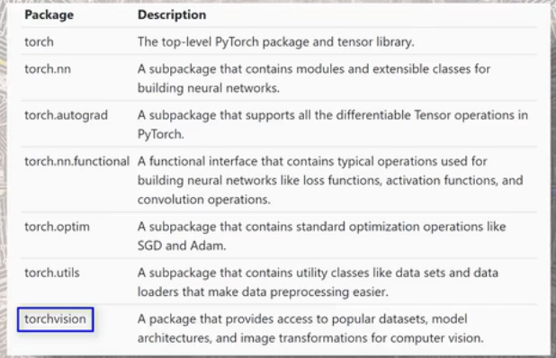
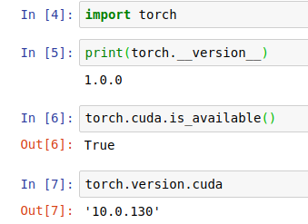
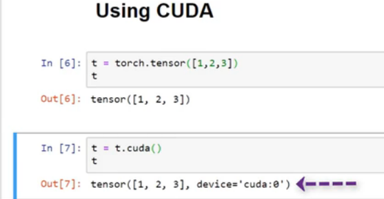
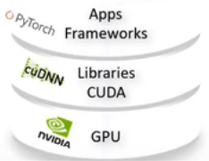
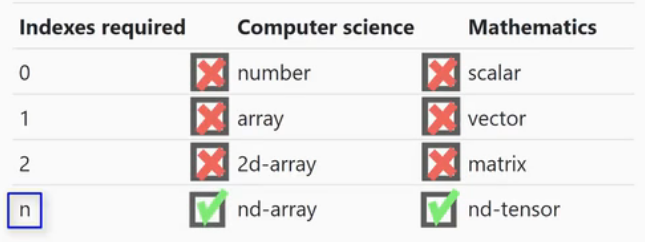
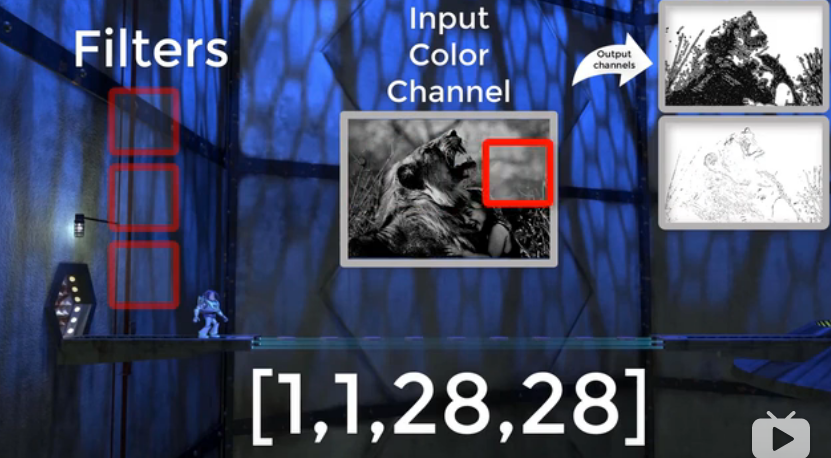
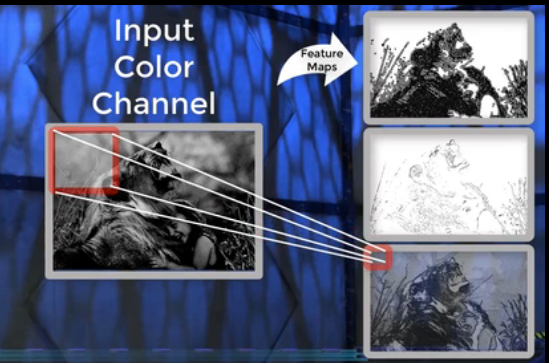
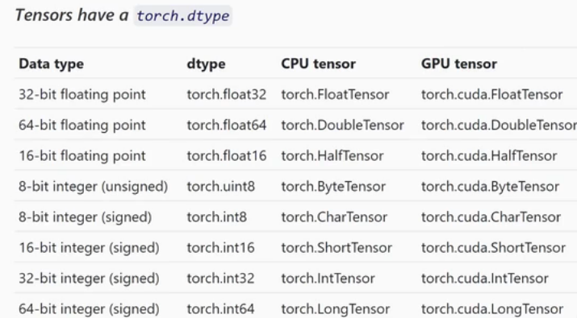
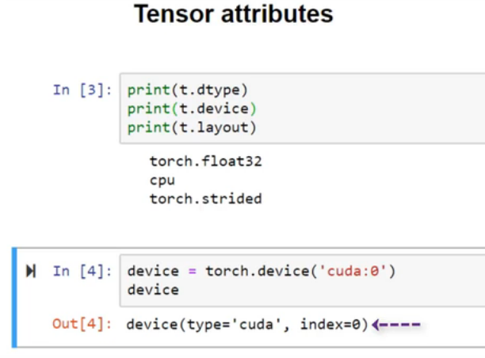
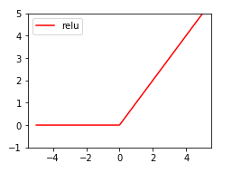

#### step1. 8个入门视频

- 
- 所有的深度学习框架都有2个特征：Tensor library，pakeage for computing derivetives。in pytorch，this 2 are `torch` and `torch.autograd`
- 

- 实验室服务器上的pytorch配置：
- 

- cuda  

 has potential thousands of **cores**

**GPU** is the hardware that enables paralel computing

**cuda** is the software that provides API for **developers**    （cuda就是来跟硬件打交道？）

**nvidia**发音/in'vidia/ 英伟达	

if you use **nvidia**,then you are requried to use **cuda**

- cuda		

- 

- 创建一个tensor，默认运行在cpu上；只需在后面添加`.cuda()`,这就将其放在了gpu上，最后一个参数是core的索引？

- 是不是gpu就比cpu快很多呢？ The truth is that `gpu` is only faster for some perticular specialized test, 

  gpu的特性是把`一个问题`分成`很多很小的部分`，当有的问题本身就很小不可再分的时候，那么cpu并不能将其加速。在早期，gpu的设计是用来处理`图形graphics`（正如他的名字），但现在多用来`训练神经网络for deep learning`，

- Tensor explained：
  - primary data struture 
  - 

有关于名称的区别：（数学 跟 计算机科学）同一行说的是同一回事儿，从图中也可以看出，`tensor`是数学上的叫法。所以，上面这些量都可以叫`tensor`：标量scalar：0维tensor，向量vector：1维tensor.....

- Tensor的三个特性（atribute）：rank，axes，shape

  - rank 几维的？ 

  - axes 几根轴啊

  - shape ：size
- CNN & Feature maps  
- 

- 

- 

- 

指定gpu，使用device指令。

要查看Tensor是在cpu还是gpu上面，使用`.device`

当两个tensor的类型不一致时，他们两个是不能作运算的

------

#### step2. 莫烦将pytorch

[链接地址](https://www.bilibili.com/video/av15997678/?p=5)

##### 2.1 numpy，torch对比

- Torch自称神经网络界的Numpy，因为它能将torch产生的Tensor放在GPU中加速运算（前提是你有合适的GPU），就像Numpy会把array放进CPU中加速运算。所以在神经网络中，当然是用torch的tensor形式的数据最好了。

- torch能和numpy很好的兼容，这样的话`numpy中的array`⇄`torch中的tensor` 两者可以相互转化

- 1.标签一般默认为LongTensor

  2.**pytorch只能处理2维的数据**  需要用到`unsqueeze`将数据进行扩展
##### 2.2 Variable变量

- 要想使用`自动求导`，只需要将所有的`tensor`包含进`Variable`对象中即可。（也就是说，tensor本身并不会进性自动求导）
- 多数情况下，将`Tensor`替换为`Variable`，代码一样会正常的工作。
- **但是时刻记住, Variable 计算时, 它在背景幕布后面一步步默默地搭建着一个庞大的系统, 叫做计算图, computational graph. 这个图是用来干嘛的? 原来是将所有的计算步骤 (节点) 都连接起来, 最后进行误差反向传递的时候, 一次性将所有 variable 里面的修改幅度 (梯度) 都计算出来, 而 tensor 就没有这个能力啦**
-  和tensorflow不一样，pytorch中模型的输入是一个Variable，而且是Variable在图中流动，不是Tensor。

##### 2.3 Activation Function

- 激活函数的目的只有一个：将之前神经网络得到的`线性输出wx`→`非线性`，即`掰弯能力`

- 当然也可以自己定义激活函数，但要注意：所创造的激励函数一定是可以微分的，只有这样才可以在反向传播的时候把误差传递回去。（查看误差，梯度的定义式子，包含有激活函数的微分项）

- 激活函数的选择（简要说一下，后面有详细的教程）1.当神经网络的层数不多的时候，各种激活函数都是可以尝试的 2.层数很深的时候，就需要考虑选择什么样的激活函数：会不会造成`梯度消失`，`梯度爆炸`...

- 在jupyter notebook上画出几个激活函数的图。需要注意的是，matplotlib并不能识别torch中的tensor数据，需要将`tensor`转化成`numpy中的array`，才可以画图

- 

#####  2.4 Regression回归

- 小例子上手
-  第一次接触 `nn.module`，理解起来稍有难度 https://blog.csdn.net/e01528/article/details/84075090

#### step3. 官方Tutorials

- [PyTorch官方Tutorials](https://pytorch.org/tutorials/)

- [PyTorch中文文档](https://pytorch-cn.readthedocs.io/zh/latest/)

--------

[非常有用的入门建议](https://blog.csdn.net/liang_xiao_yun/article/details/79540254)

第一步 github的 tutorials 尤其是那个60分钟的入门。只能说比tensorflow简单许多. 另外jcjohnson 的Simple examples to introduce PyTorch 也不错
第二步 example 参考 pytorch/examples 实现一个最简单的例子(比如训练mnist )。
第三步 通读doc PyTorch doc 尤其是autograd的机制，和nn.module ,optim 等相关内容。文档现在已经很完善，而且绝大部分文档都是作者亲自写的，质量很高。
第四步 论坛讨论 PyTorch Forums 。论坛很活跃，而且质量很高，pytorch的维护者(作者)回帖很及时的。每天刷一刷帖可以少走很多弯路，避开许多陷阱,消除很多思维惯性.尤其看看那些阅读量高的贴，刷帖能从作者那里学会如何写出bug-free clean and elegant 的代码。如果自己遇到问题可以先搜索一下，一般都能找到解决方案，找不到的话大胆提问，大家都很热心的。
第五步 阅读源代码 fork pytorch，pytorch-vision等。相比其他框架，pytorch代码量不大，而且抽象层次没有那么多，很容易读懂的。通过阅读代码可以了解函数和类的机制，此外它的很多函数,模型,模块的实现方法都如教科书般经典。还可以关注官方仓库的issue/pull request, 了解pytorch开发进展，以及避坑。
还可以加入 slack群组讨论，e-mail订阅等
总之 pytorch入门很简单，代码很优雅，是最Pythonic的框架. 欢迎入坑。

推销一个教程：chenyuntc/pytorch-book 用notebook写的教程，里面还有很多有趣的例子，比如用GAN生成动漫头像，用CharRNN写唐诗，类Prisma的滤镜（风格迁移）和图像描述等

1. 关于如何照着example实现简单的例子, 做法是认真看几遍example的实现代码.理解透,然后自己从头写, 实现相同的模型, 实在卡住了写不下去可以看一下, 但是绝对不能copy and paste. 当你实现了一个简单的例子(比如tutorial 的 mnist) 基本上对pytorch的主要内容都有了大概的了解. 写的时候会涉及 dataset,nn.module, optim, loss等许多模块, 也算是加深理解. 用pytorch 写的第一个模型是DCGAN , 用ipython notebook写的 GitHub-chenyuntc/pytorch-GAN, 然后看到了新出的大作WGAN, 在DCGAN上做了一点点修改, 就实现了WGAN, 是入门最快的一次.
2. 论坛的很多贴都是你以后可能遇到的问题 比如
如何Finetune How to perform finetuning in Pytorch?
如何从预训练好的网络中的某一层提取特征: How to extract features of an image from a trained model
论坛贴比较少, 我觉得其中一个原因是很多问题都不是问题,比如如何共享参数, 这个在tensorflow中有专门的一章讲解, 但是用pytorch写可能都不会意识到有这个问题---直接用就是了 How to create model with sharing weight? 比如如何用在模型运行时实现条件判断--直接用if. 如何查看中间结果?--直接print. 如何修改参数--直接赋值. 相比于tensorflow,pytorch更接近python的写法.
3. 关于如何阅读源代码: fork, clone ,然后用vscode打开--- 大概浏览一下, 知道类, 模块之间的关系. 然后重点阅读一些经典函数的代码, 按ctrl单击调用的函数在不同文件中跳转, 了解函数调用关系. 此外torch-vision中很多模型如ResNet的实现也很简洁.
4. 一些其它的例子:
50行实现GAN devnag/pytorch
pytorch 资源合集 The Incredible PyTorch
加强版pytorch tutorial侧重NLP spro/practical-pytorch
利用LSTM学习梯度下降法等优化方法：ikostrikov/pytorch-meta-optimizer: A PyTorch implementation of Learning to learn by gradient descent by gradient descent
WGAN的官方实现martinarjovsky/WassersteinGAN
安利
@莫烦的PyTorch教程(视频+代码)详情见专栏文章 等什么, 赶快抱紧 PyTorch 的大腿!

---------------------
